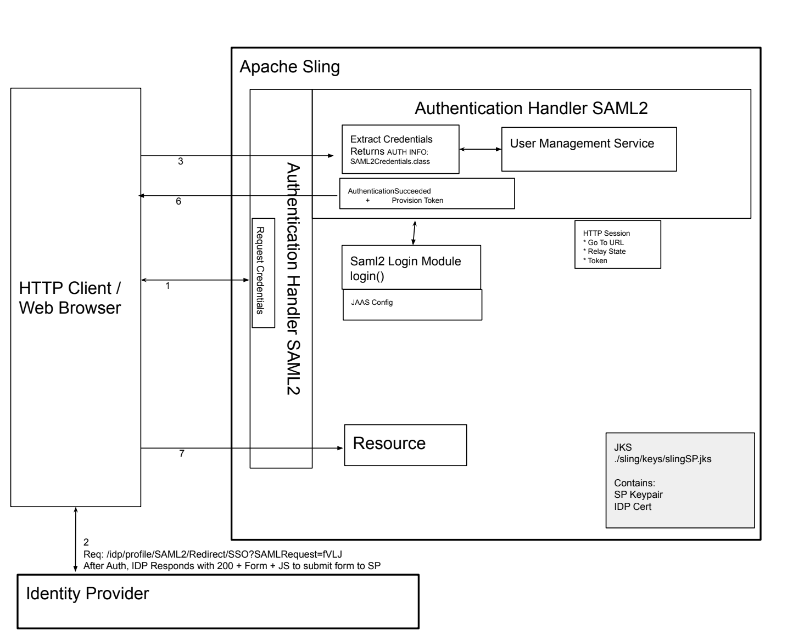
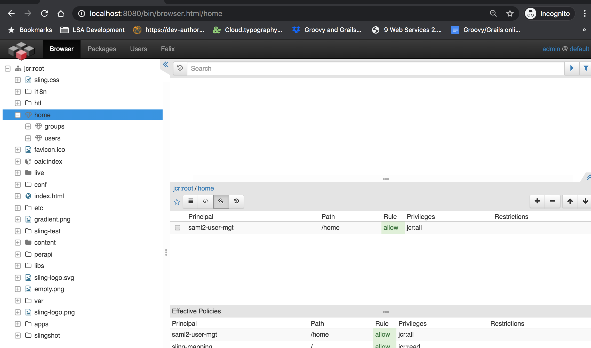
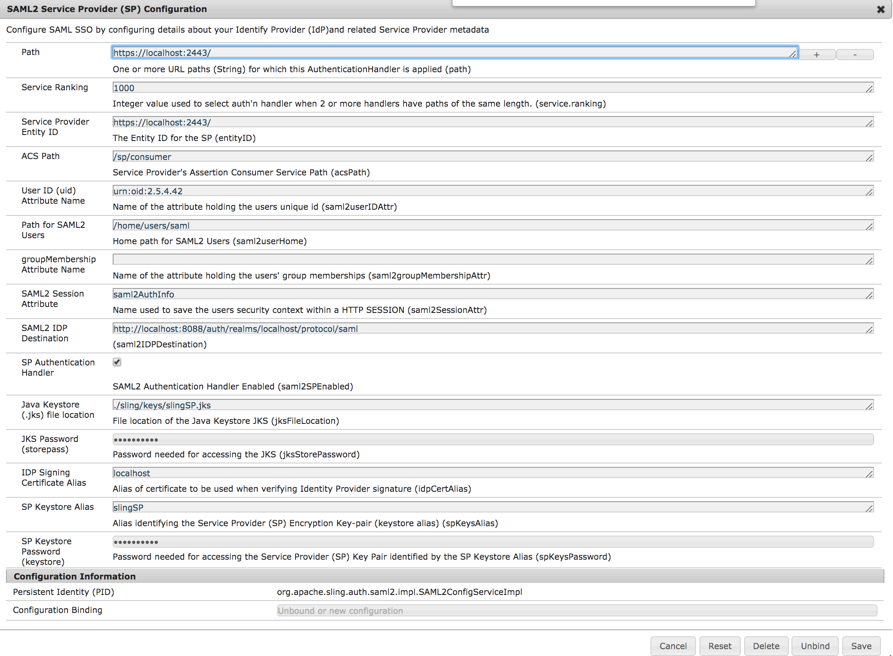
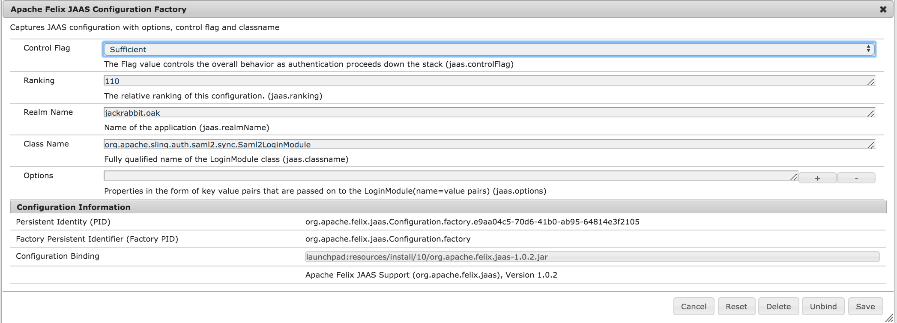
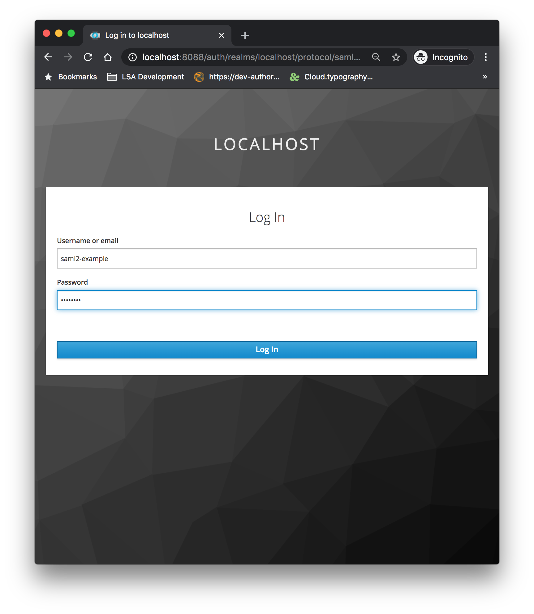
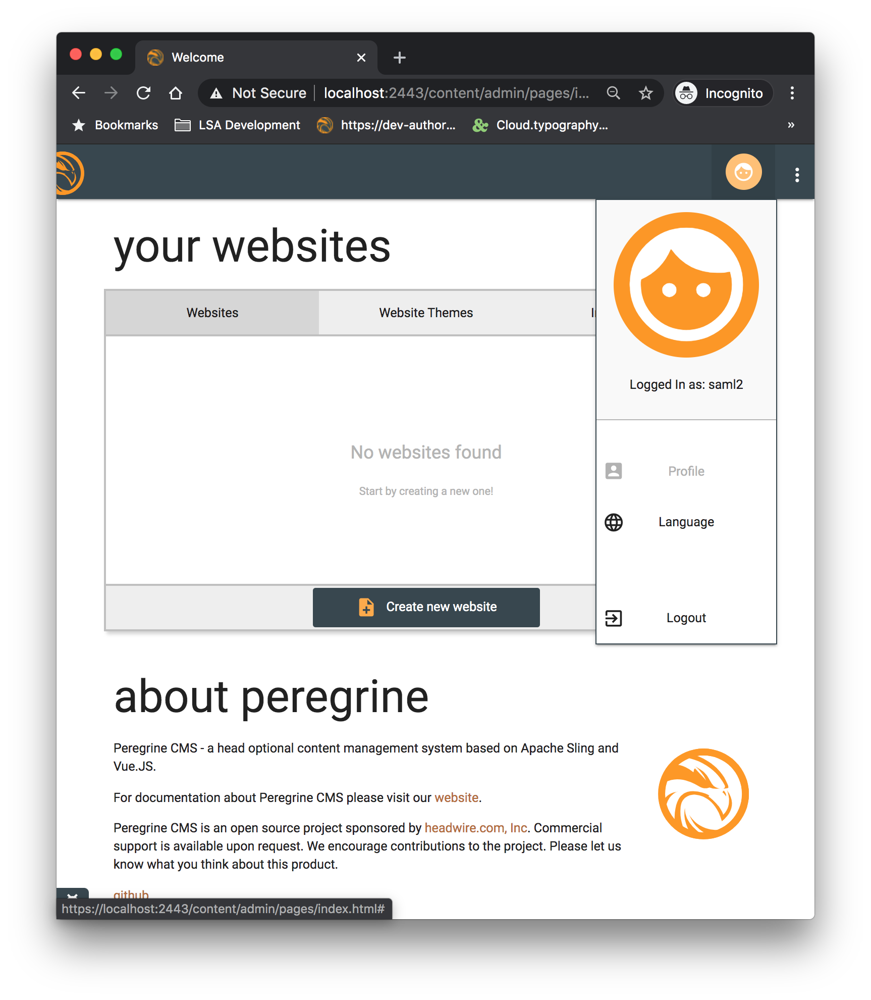
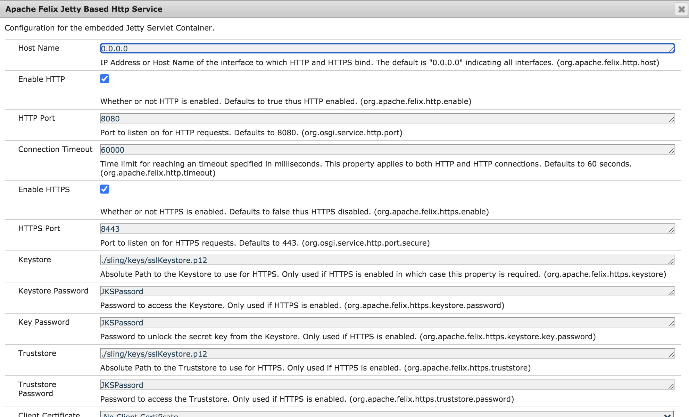
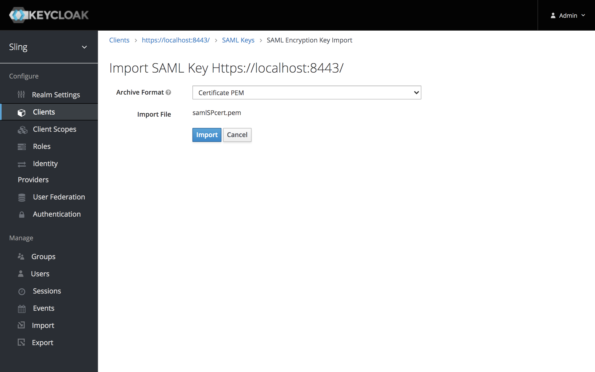
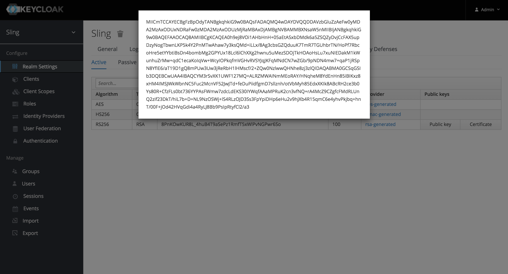

&#32;&#32;&#32;&#32;&#32;&#32; 

# Apache Sling SAML2 Handler

An OSGi bundle that provides a SAML2 Web Profile Service Provider Authentication for [Apache Sling](https://sling.apache.org) using [OpenSAML v4 libraries](https://wiki.shibboleth.net/confluence/display/OSAML/Home)
  

## Overview
https://en.wikipedia.org/wiki/SAML_2.0

* The SAMLRequest uses HTTP Redirect Binding, and the contained Authn Request object instructs the IDP to use HTTP Post Binding. 

   
Sling applications may authenticate users against an Identity Provider (idp) 
such as Keycloak Server or Shibboleth IDP.

### Requirements
- Java 11
- Sling 11 or 12
- An external SAML2 identity provider
- The [oak-auth-external](https://mvnrepository.com/artifact/org.apache.jackrabbit/oak-auth-external) bundle must be installed and active

### User Management
User management is based on the OSGi bundle configuration and SAML2 Assertion    
  - Upon successful authentication, a user is created
  - The user may be added to a JCR group membership under certain conditions: 
    - This bundle has an OSGI config `saml2groupMembershipAttr` set with the value of the name of the SAML group membership attribute. 
    - The users SAML assertion contains an attribute matching the configuration above
    - The value of the users group membership attribute is a name of an existing JCR group   
  - `syncAttrs` can be used to synchronize user properties released by the IDP for profile properties such as given name, family name, email, and phone.      
   

#### Configurations, Service User and ACL's 

##### Manual configurations set using /system/console/configMgr

Provide a [Service User Mapper OSGI Config](http://localhost:8080/system/console/configMgr/org.apache.sling.serviceusermapping.impl.ServiceUserMapperImpl.amended)
- org.apache.sling.auth.saml2:Saml2UserMgtService=saml2-user-mgt

Set up the system user "saml2-user-mgt"
- visit [Composum Users](http://localhost:8080/bin/users.html) as admin
- Create service user "saml2-user-mgt"
- Provide an ACL rule for  granting `jcr:all` to this user on the `/home` path 

   
Provide a [SAML2 OSGI Configuration](http://localhost:8080/system/console/configMgr/org.apache.sling.auth.saml2.AuthenticationHandlerSAML2) 
- path=http://localhost:8080/  
- service.ranking=1000  
- entityID=http://localhost:8080/  
- acsPath=/sp/consumer
- saml2userIDAttr=urn:oid:0.9.2342.19200300.100.1.1
- saml2userHome=/home/users/saml  
- saml2groupMembershipAttr=  
- saml2SessionAttr=saml2AuthInfo  
- saml2IDPDestination=http://localhost:8484/idp/profile/SAML2/Rediect/SSO   
- saml2SPEnabled=true   
- jksFileLocation=   
- jksStorePassword=   
- idpCertAlias=
- spKeysAlias=
- spKeysPassword=
   

Use [Composum Users](http://localhost:8080/bin/users.html) to create the group "pcms-authors" to test automatic group membership assignment

Notes:     
   - Users home "/home/users/saml" will be created once the first user successfully authenticates.    
   - After configuring the SAML2 authentication handler, the Sling Form login can still be accessed directly http://localhost:8080/system/sling/form/login?resource=%2F
   - See below technical notes for certificate, keys, signing and encryption   

[JAAS OSGI Config](http://localhost:8080/system/console/configMgr/org.apache.felix.jaas.Configuration.factory) is automatically created and removed upon bundle activation and deactivation as shown below
- jaas.controlFlag=Sufficient  
- jaas.ranking=110  
- jaas.realmName=jackrabbit.oak  
- jaas.classname=org.apache.sling.auth.saml2.sp.Saml2LoginModule  

## Test   
Visit http://localhost:8080 and observe login takes place on the http://localhost:8484 Keycloak Server IDP

Enter credentials for the user you created. After the user authenticates at the IDP, they are redirected to the orginally requested resource.

## Certificates, SSL, Signing and Encryption  
This portion discusses encryption which can be very critical for the security of this solution. 

Decide a location on the file system for the Keystores. For example, under the sling folder   
      `$ mkdir sling/keys`  
      `$ cd sling/keys`
      
### Enable Jetty HTTPS (Localhost example only, Not for prod)
It's a good idea to configure SSL for Jetty providing https binding. 

1. Create KeyStore & generate a self-signed certificate (not for production). 
    - Generate self-signed private key and public certificate 
      - $ openssl req -newkey rsa:2048 -nodes -keyout key.pem -x509 -days 365 -out certificate.pem 
    - Review Certificate (Optional) 
      - $ openssl x509 -text -noout -in certificate.pem
    - Combine key and certificate in a PKCS#12 (P12) bundle  
      - $ openssl pkcs12 -inkey key.pem -in certificate.pem -export -out sslKeystore.p12
      - JKSPassord   
2. Configure SSL and https port binding for Jetty. The following are based on the example sslKeystore.p12 created above.   
    * org.apache.felix.https.enable=B"true"  
    * org.osgi.service.http.port.secure=I"8443"  
    * org.apache.felix.https.keystore="./sling/keys/sslKeystore.p12"
    * org.apache.felix.https.truststore="./sling/keys/sslKeystore.p12"  
    * org.apache.felix.https.keystore.password="JKSPassord"  
    * org.apache.felix.https.keystore.key.password="JKSPassord" 
    * org.apache.felix.https.truststore.password="JKSPassord"         

     
### SAML Service Provider (SP) Keystore Detail and Example 
Aside from the Jetty SSL credentials discussed above, there are two other credentials to consider for a SAML2 Service Provider (SP).
* Service Provider (SP) Keypair     
* Identity Provider (IDP) Signing Certificate    

#### Keystore Setup (Localhost example only, Not for prod)
The SP Keypair is used by the IDP and SP to encrypt and decrypt SAML2 responses. It should be unique for each service provider.  
Note that the SP Keypair is also used to cryptographically sign SAML requests sent from the SP to the IDP.

1. Generate a new keypair for the Service Provider (SP) from ./sling/keys      
    * `openssl req -newkey rsa:2048 -nodes -keyout samlSPkey.pem -x509 -days 365 -out samlSPcert.pem`
    * `openssl pkcs12 -inkey samlSPkey.pem -in samlSPcert.pem -export -out samlSPkeystore.p12`         
    * View details about the generated keypair 
        * `$ keytool -list -v -keystore samlSPkeystore.p12`  
    * Make note of the storepass, alias, filename, and key password. These will all be needed to configure SP encryption.
2. Import the SP's pubic certificate (samlSPcert.pem) you made to the Keycloak Sling client 
    * Turn on "Encrypt Assertions" and save. This will expose a new tab for SAML Keys.
    * From the "SAML Keys" tab import using the 'Certificate PEM' option.     
    * Select the public certificate for the SP Keypair 

3. Import the Keycloak signing certificate
   * Select the Keys tab from the Sling realm
   * Under public keys, click and view Certificate. 
   
   * Copy paste to a file signingCert.pem
   * Import the cert.pem to the keystore 
     * `$ keytool -import -file signingCert.pem -keystore samlKeystore.jks -alias idpsigningalias`

#### Example OSGI Settings for SAML2 SP to use Keystore

##### config/org/apache/sling/auth/saml2/impl/SAML2ConfigServiceImpl.config

* acsPath="/sp/consumer"
* entityID="https://localhost:8443/"
* idpCertAlias="idpsigningalias"
* jksFileLocation="./sling/keys/samlSPkeystore.p12"
* jksStorePassword="samlStorePassword"
* path=["https://localhost:8443/"]
* saml2IDPDestination="http://localhost:8484/auth/realms/sling/protocol/saml"
* saml2LogoutURL="https://sling.apache.org/"
* saml2SPEnabled=B"true"
* saml2SPEncryptAndSign=B"true"
* saml2SessionAttr="saml2AuthInfo"
* saml2groupMembershipAttr="urn:oid:2.16.840.1.113719.1.1.4.1.25"
* saml2userHome="/home/users/saml"
* saml2userIDAttr="urn:oid:0.9.2342.19200300.100.1.1"
* service.pid="org.apache.sling.auth.saml2.impl.SAML2ConfigServiceImpl"
* service.ranking=I"42"
* spKeysAlias="1"
* spKeysPassword="samlStorePassword"
* syncAttrs=[ "urn:oid:2.5.4.4", "urn:oid:2.5.4.42", "phone", "urn:oid:1.2.840.113549.1.9.1", ]

## Attribution
This module was contributed to Apache Sling by Cris Rockwell and Regents of the University of Michigan.

## License 
Licensed to the Apache Software Foundation (ASF) under one
or more contributor license agreements.  See the NOTICE file
distributed with this work for additional information
regarding copyright ownership.  The ASF licenses this file
to you under the Apache License, Version 2.0 (the
"License"); you may not use this file except in compliance
with the License.  You may obtain a copy of the License at
  http://www.apache.org/licenses/LICENSE-2.0
Unless required by applicable law or agreed to in writing,
software distributed under the License is distributed on an
"AS IS" BASIS, WITHOUT WARRANTIES OR CONDITIONS OF ANY
KIND, either express or implied.  See the License for the
specific language governing permissions and limitations
under the License.